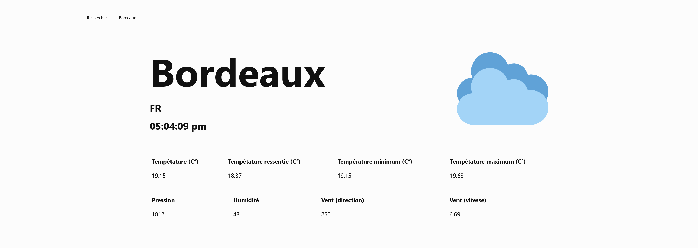
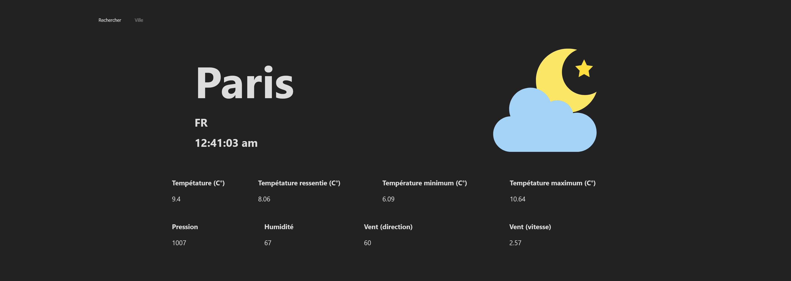
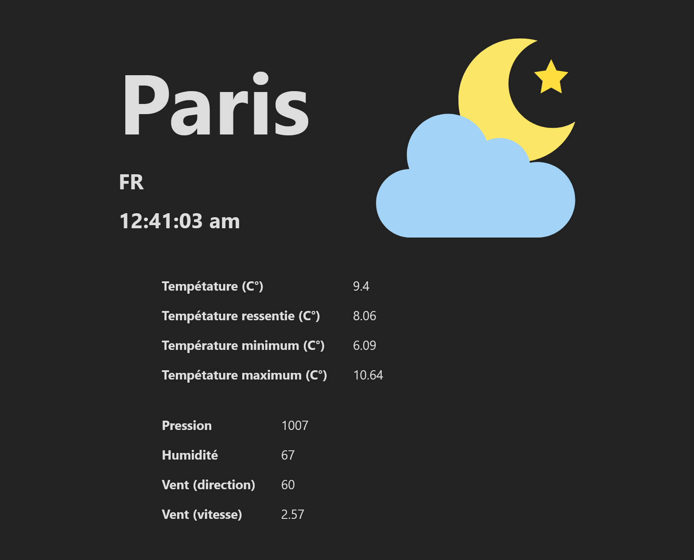

# Simple weather app

Using data from https://openweathermap.org/

Made with [Next.js](https://nextjs.org/)





## Getting Started

Set the api key ```API_KEY=``` in ```.env.local```

Run the development server:

```bash
npm run dev
# or
yarn dev
```

Open [http://localhost:3000](http://localhost:3000) with your browser to see the result.
